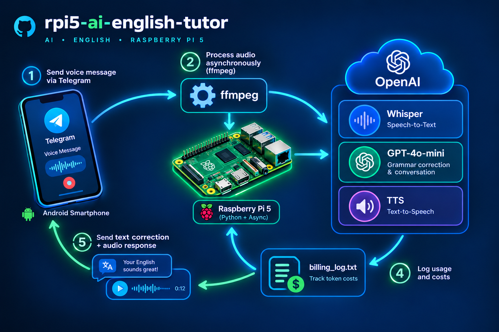

# AI-Репетитор розмовної англійської мови на Raspberry Pi 5 🤖🗣️

**Читати мене Українською** | 🌐 [Read me in English](README.md)

Асинхронний, легковаговий Telegram-бот, що працює на **Raspberry Pi 5** та виконує роль особистого репетитора з розмовної англійської мови. Проєкт побудований на базі OpenAI Whisper та GPT-4o-mini, використовує чистий асинхронний аудіо-конвеєр `ffmpeg` та має вбудований трекер витрат з наростаючим підсумком.

---

## 🗺️ Архітектура системи

Візуальна схема життєвого циклу обробки одного голосового повідомлення:



1. **Користувач** записує та надсилає голосове повідомлення через Telegram зі смартфона.
2. **Raspberry Pi 5** завантажує файл `.ogg` та асинхронно конвертує його в `.mp3` за допомогою системних утиліт `ffmpeg`.
3. Аудіодані передаються в **Хмару OpenAI**:
   * **Whisper** розпізнає голос та перетворює його в текст.
   * **GPT-4o-mini** аналізує контекст, виправляє граматичні помилки та формує навчальну відповідь.
   * **OpenAI TTS** перетворює згенерований текст на якісний аудіофайл.
4. Кількість токенів та вартість кроку миттєво записуються у файл `billing_log.txt` із розрахунком загальної суми.
5. **Raspberry Pi 5** повертає користувачу текстовий аналіз його помилок та голосову відповідь.

---

## 🛠️ Вимоги до системи та заліза

* **Залізо:** Raspberry Pi 5 (будь-яка модифікація RAM) з активним охолодженням.
* **ОС:** Чиста Raspberry Pi OS (на базі Debian 12/13).
* **Системні утиліти:** Глобально встановлений пакет `ffmpeg`.
* **API:** Акаунт розробника OpenAI із передплаченим балансом (Prepaid).

---

## 🚀 Встановлення та налаштування

1. **Клонуйте репозиторій та перейдіть у папку проєкту:**
   ```bash
   git clone https://github.com
   cd rpi5-ai-english-tutor
   ```

2. **Встановіть системні залежності:**
   ```bash
   sudo apt update && sudo apt install ffmpeg -y
   ```

3. **Налаштуйте віртуальне середовище Python та встановіть бібліотеки:**
   ```bash
   python3 -m venv .venv
   source .venv/bin/activate
   pip install -r requirements.txt
   ```

4. **Налаштуйте змінні оточення:**
   Створіть файл `.env` на основі зразка:
   ```bash
   cp .env.example .env
   nano .env
   ```
   Вкажіть власні API-ключі та збережіть файл.

5. **Запустіть бота:**
   ```bash
   python src/bot.py
   ```

---

## 📊 Фінансовий облік та прозорість

Бот автоматично додає охайний фінансовий звіт наприкінці кожної репліки:
`Cost: $0.0022 | Sum: $0.0058`

Усі розрахунки відбуваються динамічно, без використання важких баз даних, шляхом швидкого зчитування останнього рядка файлу `billing_log.txt` на накопичувачі Raspberry Pi.
